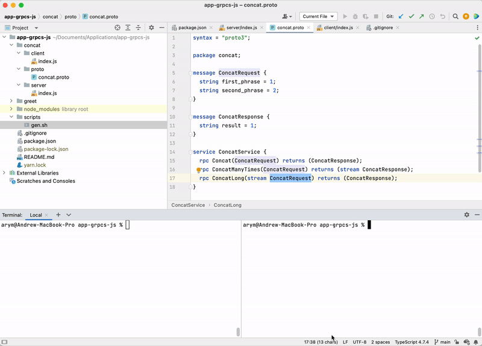

### gRPC NodeJS

```text
Useful for developers who want to understand how to write 
gRPC services and clients in NodeJS.
```




* Script in the `[concat]` folder use dynamic import of proto
* Script in the `[greet]` folder use static proto which need to pre generated due `./scriprs/gen.sh`


#### Usefully links
* [Udemy course](https://ciklum.udemy.com/course/grpc-nodejs)
* [GitHub repo](https://github.com/Clement-Jean/grpc-node-js-course)